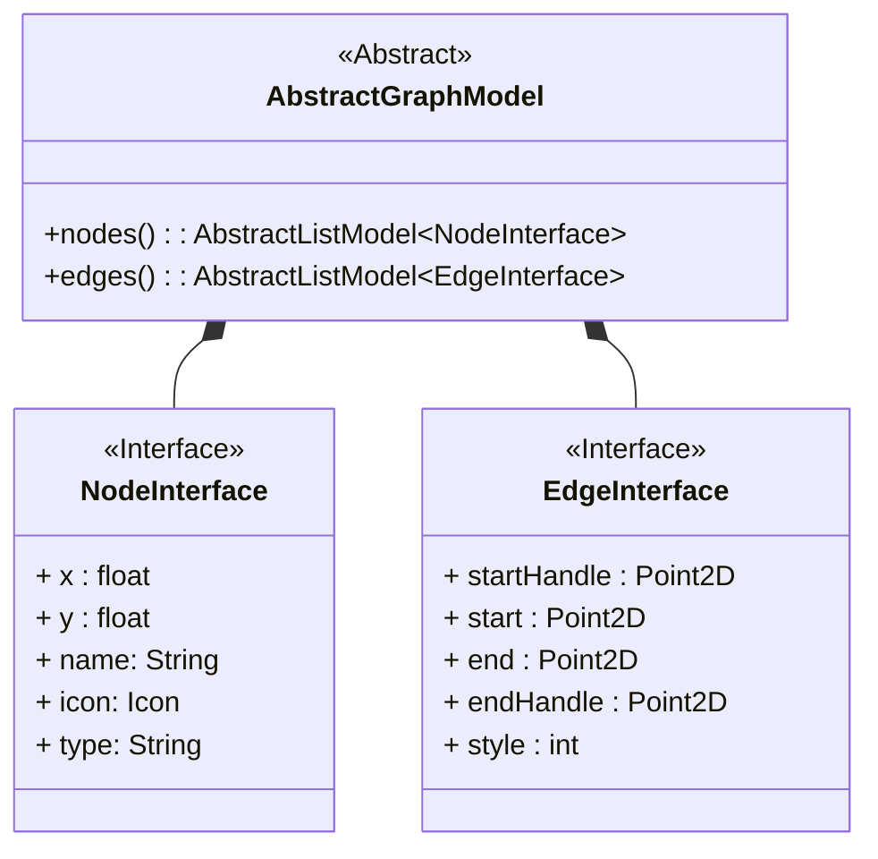

# Graph Display Architecture for QML

**Authors:**

- Adam Washington

## 1 Executive Summary

This document specifies an architecture for a graph display library
for the Dissolve QML GUI and requests discussion and suggestions for
improvement.

## 2 Motivation

Our current system for creating layers and generators has multiple issues with the user experience:

- Modules are presented in a linear list for what might be a highly
  parallel process.
- It is only possible to examine one module at a time.
- Values shared between nodes are contained in a keyword system that
  can be both opaque (hard to determine keyword values) and brittle
  (long but similar keyword names that must be typed exactly).
- It is difficult for users to create complicated layers without
  outside help.
- There is no method of gaining a high level overview of the
  activities of a layer.  Each module much be read in sequence and a
  mental modal of the entire, possibly non-linear, process must be
  constructed from this.
  
A graphical display of a connected nodes provides an alternative that
ameliorates most of these issues.

- All modules can be seen at once with the relations between modules
  explicitly declared by the connection.
- All modules and their values are present on the workspace at the same time.
- Values are shared by drawing connections between modules instead of
  variables from a global namespace.
- The graphical interface provides an intuitive framework for treating
  the modules as individual building blocks.
- One glance at the workflow gives an overview of all of the modules
  and their relations

There exist multiple libraries that will provide this type of
graphical display, but each has its own issues.  [Qt Node
Editor](https://github.com/paceholder/nodeeditor) does not natively
support QML and thus will require significant work to provide a
consistent experience with the rest of the
application. [QuickQanava](https://github.com/cneben/QuickQanava?tab=readme-ov-file)
requires the construction and maintenance of an explicit graph object,
as opposed to providing an abstract interface that we can build our
own model again.  Additionally, at the time of this writing,
QuickQanava does not build on Mac or Linux

Thus, while it would be preferred to use an existing library, the
amount of effort needed to bring one of these libraries in line with
our desired capabilities is in the realm of the effort in creating a
new library.

## 3 Proposed Implementation

The base of the implementation is an `AbstractGraphModel` class.

### 3.1 AbstractGraphModel

The `AbstractGraphModel` defines the interface to our graph.  The
internal representation of the graph is both beyond the scope of this
document[^1] and independent of the behaviour of the library.  All
that matters is that the class which represents the graph contains two
Qt properties.  The first property is `nodes`, which returns an object
that is a subclass of `AbstractListModel` and each node returned
implements the `NodeInterface` in the Qt properties.  The other
property, `edges`, is similar, except that the mandatory interface is
the `EdgeInterface`.

[^1]: Although the author does have some strong, possibly contraversial opinions.

### 3.2 NodeInterface

Each node must implement five properties. The first two, `x` and `y`,
define the position of the node on the screen.  The `name` and `icon`
provide the label and image for the top of the node.  Finally, the
`type` describe what kind of information is contained in the node.
The repeater delegate can use a
[DelegateChooser](https://doc.qt.io/qt-6/qml-qt-labs-qmlmodels-delegatechooser.html)
to select the correct QML file to display the node after dispatching
on the `type`.

### 3.3 EdgeInterface

Each edge implements five properties to do describe the spline
connecting the nodes.  The `start` and `end` properties describe the
exact starting and ending positions of the spline.  The `startHandle`
and `endHandle` are the positions of the spline handels for the
corresponding endpoints.  Finally, the `style` gives an index of the
type of line being drawn.  For example, curves containing `int` values
might have an index of 1 and `string` values an index of 2.  This
provides the View with the information to display different edges
while still deferring to the View about the exact display
(e.g. allowing different colours to be chosen in a dark mode).

### 3.4 Implementation

In the actual QML, we will create a `GraphNodeView` that takes two
parameters.  First first parameter is the `AbstractGraphModel` that
contains the graph information.  The second is a delegate that accepts
the `NodeInterface` and returns a group of widgets.  This delegate
will *not* be responsible for adding the title bar to the node or
drawing the node border.

The implementation of this QML will be two `Repeaters`.  The first
will iterate over the `nodes`, create the header and border, and use
the provided delegate to populate the nodes.  The second will iterate
over the `edges` and draw the splines.

## 4 Metrics & Dashboards

N/A

## 5 Drawbacks

## 6 Alternatives

*What are other ways of achieving the same outcome?*

## 7 Potential Impact and Dependencies

*Here, we aim to be mindful of our environment and generate empathy towards others who may be impacted by our decisions.*

- *What other systems or teams are affected by this proposal?*
- *How could this be exploited by malicious attackers?*

## 8 Unresolved questions

- Do we truly want an `AbstractListModel` for the `edges` and `nodes`?
  It would also be possible to use `AbtractTableModel` or
  `AbstractItemModel`.  I chose `AbstractListModel` since it is the
  easier to subclass, but all of these models have an element of
  ordering that we currently do not care about.  If we do care in the
  future, it might be better to have used `AbstractListModel`, but
  that also might be adding a bunch of complication now for
  functionality that we will never use.

## 9 Conclusion

*Here, we briefly outline why this is the right decision to make at this time and move forward!*

## 10 RFC Process Guide, remove this section when done

*By writing an RFC, you're giving insight to your team on the direction you're taking. There may not be a right or better decision in many cases, but we will likely learn from it. By authoring, you're making a decision on where you want us to go and are looking for feedback on this direction from your team members, but ultimately the decision is yours.*

This document is a:

- thinking exercise, prototype with words.
- historical record, its value may decrease over time.
- way to broadcast information.
- mechanism to build trust.
- tool to empower.
- communication channel.

This document is not:

- a request for permission.
- the most up to date representation of any process or system

**Checklist:**

- [ ]  Copy template
- [ ]  Draft RFC (think of it as a wireframe)
- [ ]  Share as WIP with folks you trust to gut-check
- [ ]  Send pull request when comfortable
- [ ]  Label accordingly
- [ ]  Assign reviewers (ask your manager if in doubt)
- [ ]  Merge yourself with two approved reviews

**Recommendations**

- Tag RFC title with [WIP] if you're still ironing out details.
- Tag RFC title with [newbie] if you're trying out something experimental or you're not entirely convinced of what you're proposing.
- Tag RFC title with [SWARCH] if you'd like to schedule a SWARCH review to discuss the RFC.
- If there are areas that you're not convinced on, tag people who you consider may know about this and ask for their input.
- If you have doubts, ask your manager for help moving something forward.
- As the author/s, this is _your decision_. You are empowered to choose to move forward despite dissenting comments. We're not looking for consensus-driven decision-making.
- The success of the implementation of your proposal depends on how this decision relates to our company's objectives and priorities.
