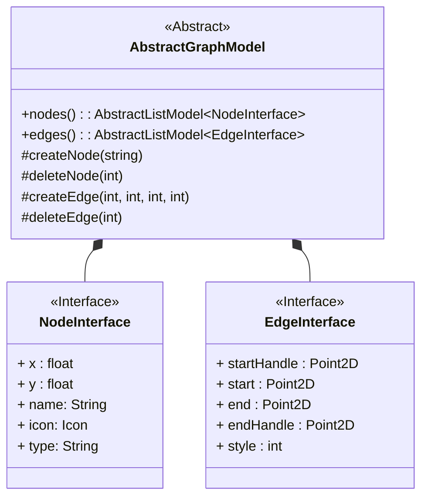

# WIP: Graph Display Architecture for QML

**Authors:**

- Adam Washington

## 1 Executive Summary

This document specifies an architecture for a graph display library
for the Dissolve QML GUI and requests discussion and suggestions for
improvement.

## 2 Motivation

Our current system for creating layers and generators has multiple issues with the user experience:

- Modules are presented in a linear list for what might be a highly
  parallel process.
- It is only possible to examine one module at a time.
- Values shared between nodes are contained in a keyword system that
  can be both opaque (hard to determine keyword values) and brittle
  (long but similar keyword names that must be typed exactly).
- It is difficult for users to create complicated layers without
  outside help.
- There is no method of gaining a high level overview of the
  activities of a layer.  Each module much be read in sequence and a
  mental modal of the entire, possibly non-linear, process must be
  constructed from this.
  
A graphical display of a connected nodes provides an alternative that
ameliorates most of these issues.

- All modules can be seen at once with the relations between modules
  explicitly declared by the connection.
- All modules and their values are present on the workspace at the same time.
- Values are shared by drawing connections between modules instead of
  variables from a global namespace.
- The graphical interface provides an intuitive framework for treating
  the modules as individual building blocks.
- One glance at the workflow gives an overview of all of the modules
  and their relations

## 3 Proposed Implementation

The base of the implementation is an `AbstractGraphModel` class.

### 3.1 AbstractGraphModel

The `AbstractGraphModel` defines the interface to our graph.  The
internal representation of the graph is both beyond the scope of this
document[^1] and independent of the behaviour of the library.  All
that matters is that the class which represents the graph contains two
Qt properties.  The first property is `nodes`, which returns an object
that is a subclass of `AbstractListModel` and each node returned
implements the `NodeInterface` in the Qt properties.  The other
property, `edges`, is similar, except that the mandatory interface is
the `EdgeInterface`.

The `AbstractGraphModel` also requires four slots for accepting
signals from the interface.  The `createNode` slot takes a string that
corresponds to the `type` property of the Node Interface and appends a
new Node of the correct type.  Correspondingly, `deleteNode` takes the
index of a node and removes that node from the model.  In the same
manner, `deleteEdge` takes an edge index and removes the corresponding
edge.  Finally, the `createEdge` slot requires four indices,
corresponding to the index of the source node, the index of the output
within that source node, the index of the destination node, and the
index of the input within that destination.

[^1]: Although the author does have some strong, possibly
    contraversial opinions.

### 3.2 NodeInterface

Each node must implement five properties. The first two, `x` and `y`,
define the position of the node on the screen.  The `name` and `icon`
provide the label and image for the top of the node.  Finally, the
`type` describe what kind of information is contained in the node.
The repeater delegate can use a
[DelegateChooser](https://doc.qt.io/qt-6/qml-qt-labs-qmlmodels-delegatechooser.html)
to select the correct QML file to display the node after dispatching
on the `type`.

### 3.3 EdgeInterface

Each edge implements five properties to do describe the spline
connecting the nodes.  The `start` and `end` properties describe the
exact starting and ending positions of the spline.  The `startHandle`
and `endHandle` are the positions of the spline handels for the
corresponding endpoints.  Finally, the `style` gives an index of the
type of line being drawn.  For example, curves containing `int` values
might have an index of 1 and `string` values an index of 2.  This
provides the View with the information to display different edges
while still deferring to the View about the exact display
(e.g. allowing different colours to be chosen in a dark mode).

### 3.4 Implementation

In the actual QML, we will create a `GraphNodeView` that takes two
parameters.  First first parameter is the `AbstractGraphModel` that
contains the graph information.  The second is a delegate that accepts
the `NodeInterface` and returns a group of widgets.  This delegate
will *not* be responsible for adding the title bar to the node or
drawing the node border.

The implementation of this QML will be two `Repeaters`.  The first
will iterate over the `nodes`, create the header and border, and use
the provided delegate to populate the nodes.  The second will iterate
over the `edges` and draw the splines.

## 4 Metrics & Dashboards

The final implementation will need to provide the following abilities:

- Add new nodes of any type
- Drag nodes to a new position
- Draw connections between nodes with the mouse
- Delete connections
- Auto-arrange nodes
- Display the nodes at multiple zoom levels
- Scroll around the node environment

None of these actions should leave the graph in an invalid state.

## 5 Drawbacks

- This project provides a significant time sink for at least one developer.

- Even once the general library is written, more developer time will
  be needed to write the Dissolve specific uses of the library

## 6 Alternatives

[Qt Node Editor](https://github.com/paceholder/nodeeditor) does not
natively support QML and thus will require significant work to provide
a consistent experience with the rest of the application.

[QuickQanava](https://github.com/cneben/QuickQanava?tab=readme-ov-file)
requires the construction and maintenance of an explicit graph object,
as opposed to providing an abstract interface that we can build our
own model again.  Additionally, at the time of this writing,
QuickQanava does not build on Mac or Linux

## 7 Potential Impact and Dependencies

This could have a significant impact on the structure of the input
file, since it represents a major change in the state of the data.
Furthermore, this may be a significant break change, as it would not
be a trivial matter to convert existing, linear code into the new
graph based setup.

## 8 Unresolved questions
  
### 8.1 Invalid Graphs

Users might attempt to connect nodes in incompatible way
(e.g. connecting a string to a value expecting an int) or fail to
provide a node with all of the information that it requires.  More
generally, the system needs to deal with the possibility of invalid
graphs.
  
This first method is to simply forbid invalid graphs.  The model
should reject any attempt to create invalid edges or delete nodes that
are required.  This had advantages in design and implementation, but
places limits on what can provide a good user experience.  For
example, every possible node input must have a **valid** default
value, so that the connection to that input can be deleted.
  
The second method is to allow invalid graphs, but refuse to run them.
This provides more flexibility in the user interface, but also
provides the challenge of informing the user about invalid graphs.  A
user might edit a graph, then switch to a different tab, come back ten
hours later and be very confused why their simulation will not run.
This becomes especially perilous in the case of saving files.  Should
it possible to save an input file with an invalid graph?  If it is,
then the user has been handed a tool to create files that break the
CLI version of Dissolve.  If saving invalid graphs is forbidden, then
a user is stuck unable to save hours of work until they have fixed the
problem with their graph.

### 8.2 Underlying iteration model

Do we truly want an `AbstractListModel` for the `edges` and `nodes`?
It would also be possible to use `AbtractTableModel` or
`AbstractItemModel`.  I chose `AbstractListModel` since it is the
easier to subclass, but all of these models have an element of
ordering that we currently do not care about.  If we do care in the
future, it might be better to have used `AbstractListModel`, but that
also might be adding a bunch of complication now for functionality
that we will never use.

### 8.3 Raw spline coordinates

Should the `EdgeInterface` truly provide raw coordinates?  An
alternative implementation would be to simply provide a source and
destination and leave the drawing up to the view.  It would also be a
more accurate representation of the data that we have.  The
disadvantage is finding a valid representation of the source and
destination that can be passed in the interface.  This is especially
relevant since we are not merely connecting nodes together, but
individual components of nodes, which might each have multiple inputs
and outputs.

## 9 Conclusion

N/A
